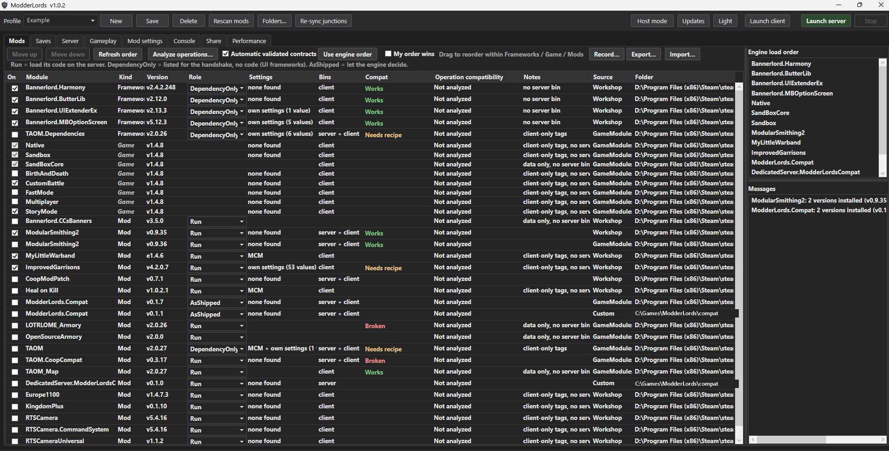
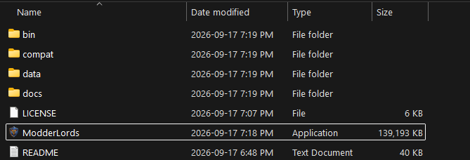
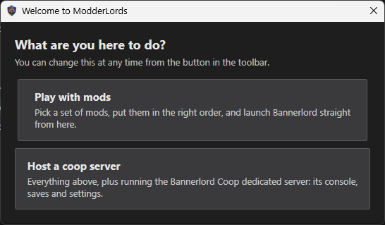
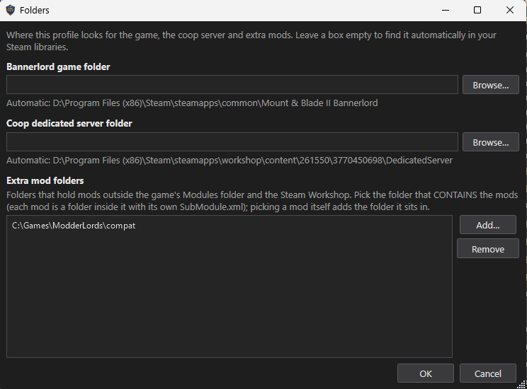
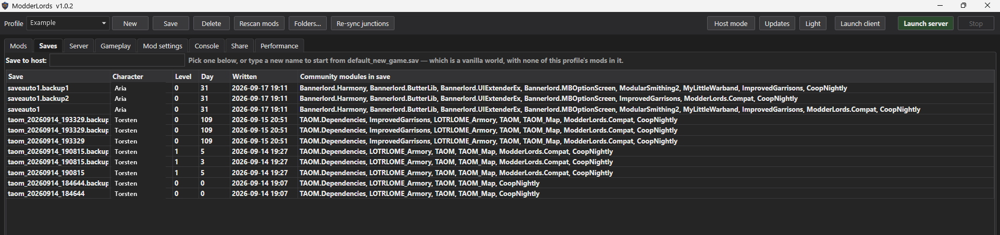
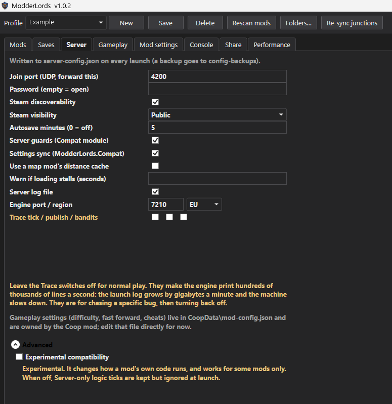
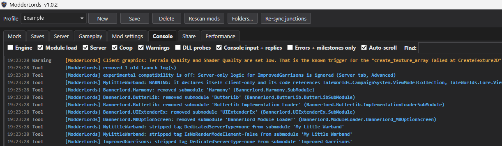
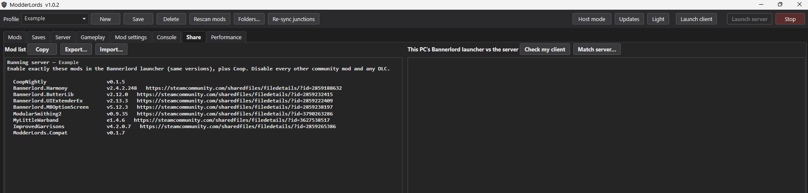
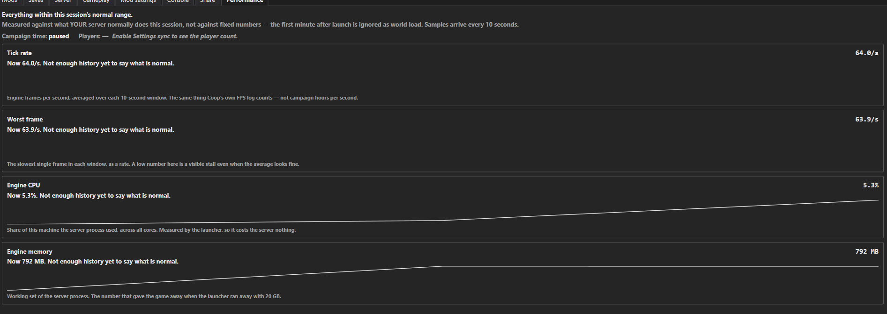
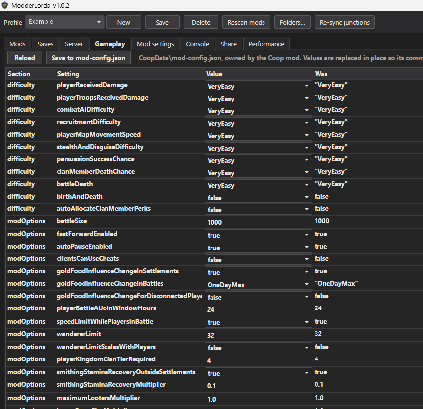

# ModderLords

**A mod loader for Mount & Blade II: Bannerlord.** Pick a set of mods, put them in the order you want, and launch
the game — without the TaleWorlds launcher. Mods load from wherever they already live, whether that is your game's
`Modules` folder or a Steam Workshop subscription. Installed mods are never rewritten or moved, and Player mode
leaves your launcher's own mod list alone. Ambiguous copies and custom mod folders use a private launch view.

It also **hosts the Bannerlord Coop dedicated server**, using the untouched official server from the Steam Workshop.
That half is kept out of the way unless you ask for it: see [Player mode and Host mode](#player-mode-and-host-mode).

Works on Mount & Blade II: Bannerlord v1.4.8; coop hosting needs Bannerlord Coop v0.1.5.



**Start here:** [Quick start](#quick-start) · [Hosting a coop server](#quick-start-hosting-a-coop-server) · [Hosting a map-replacing mod](#hosting-a-map-replacing-mod) · [Troubleshooting](#troubleshooting)

**Reference:** [What it does](#what-it-does) · [Requirements](#requirements) · [Install](#install) · [What is in the download](#what-is-in-the-download) · [Player mode and Host mode](#player-mode-and-host-mode) · [Playing on the machine that runs the server](#playing-on-the-machine-that-runs-the-server-host-mode) · [Performance](#performance) · [Sharing a mod list](#sharing-a-mod-list) · [The tabs](#the-tabs) · [App settings](#app-settings) · [Where things live](#where-things-live) · [Notes](#notes) · [Settings sync](#settings-sync-optional-players-install-one-extra-mod) · [Server-only logic](#server-only-logic-layer-1-needs-settings-sync-on) · [Mod settings](#mod-settings-host-side-live-or-offline) · [Compatibility database](#compatibility-database) · [Licence](#licence)

---

## Quick start

**What you need:** Windows 10/11 64-bit, and Mount & Blade II: Bannerlord v1.4.8 installed through Steam. Your mods
installed the normal way — under the game's `Modules` folder, or subscribed on the Workshop. Nothing else: the
download is self-contained and needs no separate .NET install. Hosting a coop server needs one more thing; see
[Requirements](#requirements).

### 1. Unzip anywhere and run `ModderLords.exe`



Nothing needs installing — run the exe from wherever you unzipped it. Keep the files together: hosting needs
`ModderLords.Hook.dll` and the `compat` folder next to the exe. If Windows SmartScreen warns about an unknown
publisher, choose "More info" then "Run anyway"; [Install](#install) explains what the app does and does not touch.

### 2. Choose what you are here to do

It asks once and remembers. The toolbar button changes it later, one click and no restart — so picking the "wrong"
one now costs you nothing.



### 3. Tick your mods, set the order, press Play

On the **Mods** tab, tick the mods you want. Drag rows, or use **Move up** / **Move down**, to set the order; the
panel on the right shows the order the engine will actually use. Click **Save** to keep the selection in the current
profile, then click **Play** — Bannerlord starts with exactly those mods.

That is the whole loop. Your TaleWorlds launcher mod list is not touched, so switching back to it later changes
nothing about how ModderLords behaves.

### If the bottom bar says the game install was not found

Click **Folders…** on the top bar and point it at your Bannerlord folder — the one containing `bin` and `Modules`.
The list rescans straight away.



Leave a box empty to keep finding it automatically in your Steam libraries. Mods kept somewhere other than the game's
`Modules` folder or the Workshop go under **Extra mod folders** in the same dialog.

**Something else wrong?** [Troubleshooting](#troubleshooting) covers the failures people actually hit.

---

## Quick start: hosting a coop server

Hosting needs **Bannerlord Coop** subscribed on the Steam Workshop (item 3770450698); the dedicated server lives
inside that workshop item and ModderLords finds it automatically.

1. Switch to **Host mode** if you are not already in it.
2. **Mods tab**: tick the mods you want on the server. Leave the roles at their defaults (see
   [The tabs → Mods](#mods)). Click **Save**.

   **Replacing the campaign map?** A total conversion such as TAOM_Map or Europe1100 needs one setting changed before
   the server can load the world at all — see [Hosting a map-replacing mod](#hosting-a-map-replacing-mod).
3. **Saves tab**: pick the save to host, or type a name that does not exist to start a fresh world. The box below the
   list shows how the selected save differs from your current mod set — the engine loads a mismatched save anyway,
   and nothing is ever rewritten.

   

   *Starting a new TAOM campaign:* select the TAOM, TAOM_Map and LOTRLOME_Armory modules and leave the save name
   empty (TAOM.Dependencies comes along on its own as a declared dependency — you do not have to tick it). The
   launcher prepares the server-safe files in its private data folder, creates a unique campaign, and then starts the
   server; creating the world takes about three minutes before hosting begins, and the Console tab shows its progress
   as `worldcreate: phase=...` lines. If you already have a TAOM save, select it instead; **Import client save** is
   available when the save only exists in Bannerlord's own save folder.
4. **Server tab**: set a password if you want one, leave the join port at 4200 (forward UDP 4200 on your router for
   direct connections; Steam joins need no forwarding).

   

5. Click **Launch server**. The Console tab shows progress; the status line reads *SERVING, waiting for clients* when
   the server is ready. First load takes about a minute.

   

6. **Share tab**: click **Copy** and send the list to your players. They enable exactly those mods and join through
   the Coop mod's server browser (Steam) or by direct IP.

   

7. Hosting and playing on the same PC? Use **Launch client** rather than Steam's Play button — see
   [Playing on the machine that runs the server](#playing-on-the-machine-that-runs-the-server-host-mode).
8. When you are done, click **Stop**. The server shuts down cleanly and autosaves.

**A player rejected, a mod crashing the server, a port already in use?** [Troubleshooting](#troubleshooting).

---
## Hosting a map-replacing mod

A mod that replaces the campaign map — TAOM_Map, Europe1100, any total conversion — needs one setting changed, and
without it the server cannot load the world at all.

**Tick "Use a map mod's distance cache" on the Server tab** (CLI: `--mod-distance-cache`).

### Why

The engine's path to the settlement distance cache is hardcoded to SandBox's copy, which was built for the vanilla
map. A map mod ships its own rebuilt cache — TAOM_Map's is 10 MB, 988 settlements — and the server never reads it.
Deserialising vanilla settlement pairs against the mod's settlements produces entries whose settlement is null, and
hashing one throws inside `NavigationCache.Deserialize`. The campaign then re-enters and tries again, forever: a
measured run sat for 2h15m without passing 81 seconds of progress, reloading the map 159,872 times. There is no error
screen and the server looks busy the whole time.

Ticking the box replaces that one file with the cache your map mod ships.

### What it does to your install

This is **the only file the launcher ever writes inside the DedicatedServer package**, which is why it is off by
default rather than automatic. Before touching anything it takes a keep-forever backup of the original beside it
(`settlements_distance_cache_Default.bin.modderlords-original`), and unticking the box puts the original back. Nothing
else in the server folder is modified.

### You will be stopped if you forget

The launcher checks before starting. If a selected mod ships its own distance cache and the box is off, the launch is
refused up front with the reason and the fix, rather than hanging for hours:

> *…ships its own settlement distance cache, so it replaces the campaign map, but this profile has "Use a map mod's
> distance cache" off. The server would read SandBox's vanilla cache against that map and crash while loading it.*

### Field battles

Field battles on a modded map work, with one known gap. The server's scene choice is what every client loads, so the
launcher excludes battle scenes that ship without a terrain shader cache — a client entering one dies in
`rglGPU_device::create_texture_array`. Of TAOM's 81 selectable battle scenes, 2 ship without that cache and are
skipped automatically; the other 79 load. You do not have to configure this.

### Load order

Map mods are also where a manifest's declared load order is most likely to be wrong: TAOM_Map's manifest asks to load
before TAOM, contradicting the order TAOM's own authors publish. If you need the order you typed to survive, tick
**My order wins** on the Mods tab — conflicts are still reported, you just get the final say.

### Where Coop loads

Coop appears in the mod list in both modes, and its position is **where Coop loads on players' machines**. Mods that
patch Coop — CoopMarriage, CoopModPatch — must sit below it, or their patches find nothing to patch and Bannerlord
crashes at startup before the main menu. None of them say so in their manifest, so ModderLords keeps the rule in its
compatibility database and moves them for you; if a profile already has one above Coop, the Mods tab says so and
offers **Fix load order**.

On the dedicated server the position is not a choice: the official host always loads Coop after every mod, with its
own server module last. ModderLords does the same, whatever the list says — so the Coop row in Host mode is only ever
about the players' game, which is the copy the host is handing out.

---


## What it does

### As a mod loader

- **Launches your game directly** with exactly the mods you ticked, in the order you chose. The module list is passed
  on the command line, which *replaces* `LauncherData.xml` — so your TaleWorlds launcher selection is never read and
  never rewritten.
- **Finds mods wherever they are**: the game's `Modules` folder and every Steam Workshop subscription. Workshop ids
  resolve on their own, so nothing is copied or linked for playing.
- **Gets the load order right.** Frameworks whose manifest says the game's own modules load after them — Harmony,
  ButterLib, UIExtenderEx, MCM — are placed ahead of `Native`, exactly as the TaleWorlds launcher does. Get this
  wrong and ButterLib opens a pop-up recommending you close the game.
- **Shows every installed copy.** If a mod exists twice at different versions (a local build in `Modules` and the
  Workshop release, say), both are listed and you choose which one loads. Ticking one unticks the other, because the
  engine loads a module id once. When necessary, a private launch folder links the selected copies into its own
  `Modules` directory so the game resolves the requested version. The original installations stay in place.
- **Profiles**: named mod sets with order, saved and switched freely. Share one as a file; import somebody else's.

### As a coop host

- **Launches the official server engine directly** with the module list and load order you choose.
- **Uses mods where they are.** Your game `Modules` folder and Steam Workshop items are linked into the server with
  NTFS junctions (no admin rights). Removing a mod removes only the link. Workshop updates flow through automatically.
- **Loads client-only mods on the server.** Mods that only ship a client build, or whose manifest says "client only", get
  a small shadow copy of their `SubModule.xml` so the headless server accepts them; the mod folder itself is never edited.
- **Resolves mod DLLs the engine cannot find.** A tiny helper is loaded into the engine that finds each mod's own
  libraries and the client-only UI assemblies mods reference. It patches nothing.
- **Saves**: reads every save's header (character, level, day, mods it was written with) and shows how it differs from
  your profile. Never blocks a launch and never rewrites a save; the engine loads mismatched saves with a warning.
- **Server settings** rendered into `server-config.json` (port, password, Steam discoverability, autosave, log file),
  with a backup of the previous file each time.
- **Gameplay settings** (`mod-config.json`: difficulty, fast forward, auto pause, cheats, looter multiplier, and so on)
  edited in place, keeping the Coop mod's own comments.
- **Readable console**: every engine line is classified (engine chatter, module loading, server, Coop, warnings,
  errors, milestones). Filter by category, search, show errors only, send console commands, and stop cleanly.
- **Player mod list**: a copyable list of exactly what players must enable (Coop requires an exact match of community
  mods and versions), plus a "check my client" button that compares this PC's Bannerlord launcher selection to the server.
- **Version drift banner**: if a mod updated since your last launch, you are told players must update and the server
  needs a restart.
- **Safety**: the server is tied to the launcher, so it can never linger headless if the launcher closes; errors are
  logged instead of crashing the app.
- **Server guards** (the bundled `DedicatedServer.ModderLordsCompat` module): single-player mods that open inquiries or
  screens on the headless server get their pop-ups answered and their screen pushes swallowed instead of crashing.
  Server-only; players need nothing extra. The Mods tab shows a **Server verdict** per mod (server-safe / guarded /
  needs review) from a scan of what the mod's DLLs reference; nothing is executed to compute it.

---

## Requirements

To play with mods:

- Windows 10/11, 64-bit.
- Mount & Blade II: Bannerlord v1.4.8 installed through Steam (ModderLords finds it in any Steam library).
- Your mods installed the normal way: under the game's `Modules` folder or subscribed on the Workshop.

To host a coop server, additionally:

- **Bannerlord Coop** subscribed on the Steam Workshop (item 3770450698). Its dedicated server lives inside that
  workshop item; ModderLords finds it automatically.
- Everyone who joins needs the same community mods and versions enabled in their own Bannerlord launcher, and the War
  Sails DLC disabled. Use the Share tab to hand them the list.

The release zip is self-contained; no separate .NET install is needed.

---

## Install

1. Unzip the release anywhere (for example `C:\Games\ModderLords`). Keep all files together — hosting needs
   `ModderLords.Hook.dll` and the `compat` folder next to the exe; playing needs neither, but there is no reason to
   split them up.
2. Run `ModderLords.exe`. It asks once whether you are here to play with mods or to host a coop server.
3. If Windows SmartScreen warns about an unknown publisher, choose "More info" then "Run anyway". The only
   network connection it makes is a check for a newer ModderLords release on GitHub when it starts; nothing is downloaded
   unless you click **Update now** (see [Updates](#updates)). It changes nothing outside the folders listed under
   "Where things live".

   <a id="updates"></a>**Updates.** When a newer release exists, a green banner offers **What's new**, **Update now**,
   **Later** and **Skip this version**. Update now downloads the release, checks it against the checksum GitHub
   publishes, replaces this copy and restarts; your profiles are kept, and the files it replaced are kept in a
   `.previous` folder beside the exe. **Updates** on the top bar checks straight away. It cannot update a copy in a
   folder you cannot write to (such as Program Files) and opens the download page instead. To turn the startup check
   off, set `"CheckForUpdates": false` in `%LOCALAPPDATA%\ModderLords\ui-state.json`.

To uninstall: delete the folder. Playing with mods creates nothing inside your game install, so there is nothing
else to clean up. If you hosted, remove the links it created inside the server: first click **Delete** on each
profile (that removes its junctions), or delete `%LOCALAPPDATA%\ModderLords` and the junctions under
`...\steamapps\workshop\content\261550\3770450698\DedicatedServer\engine\Modules` (they are the entries that are links,
not the five stock folders `Native`, `SandBoxCore`, `SandBox`, `Coop`, `DedicatedServer.Windows`).

> **Upgrading from Modular Bannerlords Coop?** This is the same project under a new name. Your profiles, local
> compatibility records and settings caches are copied automatically on first run from `%LOCALAPPDATA%\ModularCoop`
> to `%LOCALAPPDATA%\ModderLords`; the old folder is left untouched and can be deleted once you are happy. The
> launcher's own in-game modules were renamed too, so delete the leftover `ModularCoop.Compat` and
> `DedicatedServer.ModularCoopCompat` folders from your game's `Modules` directory — the Mods tab reminds you if
> they are still there. From v0.9.0 the licence is [PolyForm Noncommercial](LICENSE): you may now share and modify
> this, noncommercially.

---

## What is in the download

```
ModderLords.exe   the launcher (everything it needs is inside it)
README.txt                   this guide
LICENSE
bin\                         the assembly-resolution hook the server loads
compat\                      the two modules: server guards, and the shared sync module players install
data\                        the bundled compatibility database
docs\                        this guide as markdown, the roadmap, third-party notices
```

Nothing needs unpacking or installing: run the exe from wherever you unzipped it.

---

## Player mode and Host mode

ModderLords asks once, on first run, which one you want, and remembers it.

- **Player mode** is the mod loader: the **Mods** and **Share** tabs, and the **Play** button. Nothing about
  dedicated servers appears anywhere.
- **Host mode** is all of that plus running the Bannerlord Coop dedicated server: the Saves, Server, Gameplay, Mod
  settings, Console and Performance tabs, the server buttons, and the server half of the Share tab.

Switch whenever you like with the mode button in the toolbar — one click, no restart. Stop the server first if one is
running. Your window size, theme and selected tab are remembered between runs too.

---

## Playing on the machine that runs the server *(Host mode)*

> In Player mode the same button reads **Play** and does something simpler: it passes your mod list to the game on
> the command line and writes nothing to disk. Everything below is about Host mode, where the point is to join the
> server you are running, so the *server's* mod list is the one that has to be matched.

While the coop server is up, Steam's **Play** button for Bannerlord is unavailable: the Coop mod logs the server on
to Steam as a game server for Bannerlord, so Steam treats the game as already running. This is part of the official
Coop dedicated server package (its assemblies are hash-verified at boot, so it cannot be turned off) and not
something this launcher does.

**Launch client** in the top bar starts Bannerlord directly with an explicit module selection matching the server,
including its Coop client module. If the server is running, its captured launch selection is used even while you
edit another profile. The client is independent of this app — closing ModderLords does not close your game.

Before it starts the game it also brings your module list in line with the server, so the join is not refused over
a mismatched mod list. It shows you exactly what it will change first — which mods it turns on, which it turns off
(Coop rejects a client that has community mods the server does not), and any it reorders to match the server's load
order — and nothing is written until you accept. Tick **Don't ask again for this profile** to have it apply silently
from then on.

The official module selection is reconciled with the profile; your multiplayer mod list and the launcher's DLL
list are left alone. The previous file is copied to
`%LOCALAPPDATA%\ModderLords\launcher-backups\<timestamp>\` before every change. What it cannot do is install a
missing mod or change a version already on disk. Missing selected modules and versions that do not match the server
stop the launch with an explanation, so an incomplete set is not started accidentally.

A mod you subscribed to since the Bannerlord launcher last ran is not in that file at all — the launcher only lists
what it has scanned — so the sync adds the entry itself rather than telling you the mod is missing. It also warns
when a mod is still ticked in the launcher but its folder has gone from this PC.

Launch client also keeps the shared `ModderLords.Compat` module installed for you. When a profile uses Settings
sync, the launcher copies its own bundled build into `<game>\Modules\ModderLords.Compat`, and replaces it whenever
the build it carries is newer than the one already there — so you never copy it out of the release zip by hand, and
it cannot fall behind. It never downgrades a newer copy, never touches any other module, and keeps the copy it
replaced under `%LOCALAPPDATA%\ModderLords\module-backups\`. If your game lives somewhere Windows will not let the
launcher write, it says so instead of failing quietly.

**Share tab → Match server…** shows the same comparison on demand, including when there is nothing to change, so
you can check what Launch client would do without launching anything.

---

## Performance

The **Performance** tab shows how the server is running: tick rate, the worst single frame in each window, the
engine process's CPU share and memory, plus whether campaign time is actually moving.



There are no fixed good/bad numbers, because there aren't any — what is normal depends on your machine, your mod
set and how many people are on. Instead it learns what YOUR server does: the first minute after launch is ignored
as world load, and after that each reading is compared against the session's own normal range. It only says
something is wrong when a metric has sat outside that range for 30 seconds, so a save write or someone joining does
not raise a false alarm.

Measuring is deliberately cheap. The server counts frames in a few variables and prints one line every ten seconds;
CPU and memory are read by the launcher watching the process, which costs the server nothing at all. Those two are
the numbers that would have shown v0.8.3's runaway long before the stutter was noticeable. Tick rate needs the
compat guards module (on by default); the player count needs Settings sync, and the tab says so when it is missing.

Each session's summary is written to `%LOCALAPPDATA%\ModderLords\perf\` so real thresholds can be worked out later
from real data.

---

## Sharing a mod list

Available in both modes: handing somebody your modpack is what a mod loader is for.

**Share tab → Export…** writes the mod list to a `.json` file: every mod with its version and workshop link, the
Coop build you are running, the server-side roles, and — as the order of the list itself — the load order. Send that
file to whoever needs it. Optional official modules and DLC selections are included too; older lists that do not
specify them retain the default behavior. Sharing and export refresh the current selection automatically.

The order written to the file is always the **player's** order, including where Coop sits, so exporting one profile
from Host mode and from Player mode produces the same file. Lists written before ModderLords 1.0.3 did not record
Coop's position; importing one leaves your Coop where it is and says so.

Imported modules that are not installed remain visible as **Missing**, with their requested versions and download
links retained. They are not passed to the engine. Download them and click **Rescan** to resolve them, or untick them
to launch an intentionally reduced set. Exporting again preserves the missing requirements.

In Host mode, the shared list is labeled with the running server's profile and stays tied to its launch snapshot.
Edits to another profile take effect on a later server launch. Player mode always uses the selected player profile,
so you can test a mod set alone and then switch to Host mode without losing it. Coop is selectable in Player mode.

Private client launch views live under `%LOCALAPPDATA%\ModderLords\client-launches`. They contain directory links
and copies of the game root's small top-level files, not copies of installed mods. They remain after ModderLords
closes so a detached game can keep using them. Do not remove a view while its game is running.

**Import…** reads one back and offers the two things it is good for, either or both:

- **Create a profile.** Same mods, same order — and, for another host, the same roles — ready to launch. Copies are
  found by id on their PC, so your folder layout does not have to be reproduced.
- **Set up my Bannerlord launcher to match.** For somebody who still plays through the TaleWorlds launcher, or is
  joining a server: it ticks the right mods, unticks the rest and puts them in your order, showing you the changes
  first.

The file cannot install mods. Anything the importer does not have is listed as missing, with the workshop link where
one is known.

---

## The tabs

**Mods** and **Share** are always there. **Saves**, **Server**, **Gameplay**, **Mod settings**, **Console** and
**Performance** appear in Host mode only, and so do the coop-only columns of the Mods tab described below.

### Mods


Every module found on this PC, in three bands:

1. **Frameworks** — mods whose manifest says the game's own modules load *after* them (Harmony, ButterLib,
   UIExtenderEx, MCM). They sit above the game, as the TaleWorlds launcher also places them.
2. **Game** — the game's own modules and DLC. You can turn these on and off; the engine decides their order.
3. **Mods** — everything else, loading after the game.

A row is dragged, or moved with **Move up** / **Move down**, freely inside its band and never out of it: which band a
mod is in comes from its manifest, not from preference, so a move across would simply be undone by the next sort. The
buttons grey out at the ends of a band, and a drag shows a line where the row will land.

A mod installed more than once at **different versions** gets one row per version, with the folder shown, so you can
pick the copy that loads. Ticking one unticks the others; the engine loads a module id once. Two copies at the same
version are one row.

Stock server modules and Coop itself are never listed.

| Column | Meaning |
|---|---|
| On | Load this mod (single click). |
| Kind | `Framework`, `Game`, `DLC` or `Mod` — which band the row is in, and why it sits where it does. |
| Version | What the mod's `SubModule.xml` says. Bannerlord versions are a prefix letter then numbers only (`v1.2.3`, `e1.4.6`); anything else is read as `a0.0.0` by the game and everything else, so a version that cannot be parsed is shown as written and flagged in Notes. |
| Role | Host mode only. See below. |
| Bins | Host mode only. Which builds the mod ships: `server` (made for dedicated servers), `client`, or both. |
| Compat | Host mode only. The curated verdict from the compatibility database (see below): green **Works**, amber **Needs recipe** (works with Server-only logic and the recorded behaviours), red **Broken**, grey **Unknown**. `· untested version` means your copy is not one of the versions the record was checked with. Hover for notes, tested versions and where the record came from. Empty = no record yet. |
| Settings | What the Mod settings tab will find for this mod: `MCM`, `own settings (N values)` (a plain settings class found by the scan), both, or `none found`. Hover for the class names. |
| Server verdict | Host mode only. `server-safe`: no UI or client-only references. `guarded`: uses inquiries or screens that the server guards handle. `needs review`: constructs UI objects or references StoryMode; may still work (hover for details), test it. |
| Notes | Host mode only. `version the game cannot read`: the manifest's version is not a form Bannerlord parses. `client-only tags`: its manifest asks servers to skip it (handled by the Run role). `data only`: XML content, no code. |
| Folder | Where the mod lives. A number as the folder name means a Steam Workshop item. |

**Roles** (Host mode only)

- **Run**: load the mod's code on the server. The default for gameplay mods.
- **DependencyOnly**: keep the mod in the list so the Coop handshake matches players, but load none of its code. The
  default for client-side frameworks: Harmony, ButterLib, UIExtenderEx, MCM (MCM's settings core is still loaded so
  mods that read settings work).
- **AsShipped**: hand the manifest to the engine unchanged and let it decide. Only for mods built for dedicated servers.

**Order**: the right-hand panel shows the full engine order — what will actually be loaded, after dependencies are
resolved. **Use engine order** sorts the list to match it. Messages about missing dependencies, duplicate versions and
unreadable version numbers appear under it.

**Rescan mods** re-reads the disk. **Re-sync junctions** (Host mode) recreates the links inside the server after a

**Toggles above the list**

| Toggle | Default | What it does, and when to change it |
|---|---|---|
| My order wins | off | Use the list exactly as you wrote it, even where a mod's manifest declares a different order. Conflicts are still listed under the order preview, so you can see what you are overriding. Leave it off unless a mod's declared order is wrong — which does happen; see [Hosting a map-replacing mod](#hosting-a-map-replacing-mod). |
| Automatic validated contracts | on (Host mode) | Let a shipped compatibility contract activate itself when it fingerprint-matches the exact binaries you have installed **and** has passed offline and integration validation. Nothing activates on a guess. Turn it off to run with no automatic adapters at all. |
| Server-only logic | off per mod | Only visible with **Experimental compatibility** on (Server tab → Advanced). See [Server-only logic](#server-only-logic-layer-1-needs-settings-sync-on). |
Workshop update or after Steam re-downloaded the server.

### Saves *(Host mode)*

Every `.sav` in the server's save folder with the character, level, day and the community mods it was written with.
Selecting one sets it as the save to host. The box below lists differences between that save and your current mod set.
The engine loads such a save anyway and logs *module mismatch ... Forcing load anyway*; the tool never rewrites a save.

Typing a name that does not exist starts a **vanilla** world from the official `default_new_game.sav`. When the selected
modules include TAOM, TAOM_Map and LOTRLOME_Armory and the name is new, the launcher creates that campaign in a
private preparation phase before hosting it. The launcher does not ask users to copy `AssetPackages`, `DsAssetPackages`,
or any other game files.

### Server *(Host mode)*


Everything here is saved in the profile. The connection settings are written into `server-config.json` at launch, with
a backup of the previous file under `config-backups`; the rest change how the launcher prepares and watches the server.

| Setting | Default | What it does, and when to change it |
|---|---|---|
| Join port | 4200 | The UDP port players connect to. Forward it on your router for direct joins; Steam joins need no forwarding. Change it only if something else on the machine already has 4200. |
| Password | empty | Players are prompted for it. Empty means anyone who can reach the server may join. |
| Steam discoverability | on | Advertise the server on Steam, so players can find it in the Coop mod's browser without port forwarding. Needs a logged-in Steam client running on this machine. Turn it off for a private, direct-IP-only server. |
| Steam visibility | Public | Who sees the advertised server: public, friends only, or none. Only meaningful with discoverability on. |
| Autosave minutes | 5 | How often the server autosaves. `0` disables it — don't, unless you are testing. |
| **Server guards** (Compat module) | **on** | Loads the launcher's `DedicatedServer.ModderLordsCompat` module, which answers inquiries and swallows screen pushes so single-player mods do not crash the headless host. Server-side only; players need nothing. Leave it on — turn it off only to prove a crash is not caused by the guards. |
| **Settings sync** (ModderLords.Compat) | **off** | Pushes the server's MCM settings to joining players, and enables the [Mod settings](#mod-settings-host-side-live-or-offline) tab. It adds the shared `ModderLords.Compat` module to the server **and to the player mod list**, so every player must install and enable it — see [Settings sync](#settings-sync-optional-players-install-one-extra-mod). Turn it on when you want mod settings decided by the host rather than by each player's local file. |
| **Use a map mod's distance cache** | **off** | Required for any mod that replaces the campaign map. See [Hosting a map-replacing mod](#hosting-a-map-replacing-mod) — leave it off otherwise. |
| **Generate a new world with the active mods** | **off** | Only applies when a **new** save has to be made. On, the launcher runs the engine once with your mods loaded and generates the campaign from them; off, it copies the vanilla `default_new_game.sav`, which lists only Native, SandBoxCore, Sandbox and Coop — so the world will not contain your mods, and the launch says so. An existing save is always loaded untouched, whatever this is set to. Generating costs one extra engine run before the server starts (up to 15 minutes with heavy mods). |
| **Bannerlord.Harmony / ButterLib / MBOptionScreen role** | **Dependency-only** | The launcher refuses to start if any of these is set to Run or As-shipped. They are client-side infrastructure and need Mono.Cecil and the MonoMod assemblies, which the DedicatedServer package does not ship; the engine dies during assembly load about five seconds in. If you need a mod whose setup runs through Harmony at campaign creation, build that campaign in the real game and bring it over with **Import client save**. |
| **Warn if loading stalls** (seconds) | empty (5 minutes) | How long the launch console waits with no loading progress before saying so. `0` turns the warning off. Heavy mods can legitimately load for a very long time — TAOM's authors quote up to two hours — so raise it or set `0` for those rather than being nagged. |
| Server log file | on | Also write the server's own `logs\coop-server-*.log`, separate from the launcher's per-launch log. |
| Engine port / region | 7210 / EU | Internal engine values; leave them alone unless you know why you are changing them. |
| Trace tick / publish / bandits | off | **Diagnostics only.** These make the engine print hundreds of thousands of lines a second: the launch log grows by gigabytes a minute and the whole machine slows down. Use them to chase a specific bug, then turn them back off. |

Under **Advanced** there is one more:

| Setting | Default | What it does, and when to change it |
|---|---|---|
| Experimental compatibility | off | Enables the **Server-only logic** column on the Mods tab and opt-in tracing. While it is off, Server-only logic ticks are kept in the profile but ignored at launch, and the launch console says so. It changes how a mod's own code runs and works for some mods only — see [Server-only logic](#server-only-logic-layer-1-needs-settings-sync-on). Applies to the next launch. |


### Gameplay *(Host mode)*

The Coop mod's `mod-config.json`: campaign difficulty (VeryEasy / Easy / Realistic per category), births and deaths,
fast forward, auto pause, client cheats, gold and food rules, wanderer limit, kingdom clan tier, smithing stamina,
looter multipliers, executions, nameplates. Edit, then **Save to mod-config.json**. Applies on the next server start.



### Console *(Host mode)*

Filters: **Engine** (the engine's own chatter, off by default), **Module load**, **Server**, **Coop**, **Warnings**,
**DLL probes** (see Troubleshooting), **Errors + milestones only**, **Auto-scroll** (follow the end; scrolling up
pins the view). **Find** filters by text. Type a server command in the box and press Enter (`help` lists them; `stop`
shuts down). **Logs folder** opens the launcher's own per-launch logs.

### Share

Left, in both modes: the exact mod list to hand somebody, with Workshop links where known, plus **Copy**, **Export…**
and **Import…**.

Right, in Host mode only: **Check my client** reads this PC's Bannerlord launcher selection and reports what the Coop
validator would say (missing, not enabled, version differs, extra mod enabled, DLC enabled), and **Match server…**
shows what would change and offers to apply it.

---

## App settings

These are the launcher's own, not a profile's. Most have a control in the app; the file is
`%LOCALAPPDATA%\ModderLords\ui-state.json`, read at startup and written on exit — **close ModderLords before editing
it by hand**, or your edit will be overwritten.

| Setting | Where | What it does |
|---|---|---|
| Mode | toolbar button, one click, no restart | Player mode or Host mode; see [Player mode and Host mode](#player-mode-and-host-mode). Delete this value from `ui-state.json` to be asked again on the next start. |
| Theme | **Light** / **Dark** button on the top bar | Remembered between runs. |
| `CheckForUpdates` | `ui-state.json` only | `false` stops the check on startup. **Updates** on the top bar still checks on demand. See [Updates](#updates). |
| `SkippedVersion` | set by **Skip this version** on the update banner | That one version is never mentioned again; a later one still is. Clear it to be offered the skipped version again. |
| Window size, position, selected tab | remembered automatically | — |

Per-profile things without a tab of their own:

| Setting | Where | What it does |
|---|---|---|
| Don't ask again for this profile | the **Launch client** confirmation dialog | Applies the launcher-list changes silently from then on. Warnings the sync cannot fix are still reported either way. |
| Extra mod folders | **Folders…** on the top bar | Folders holding mods outside the game's `Modules` folder and the Workshop. Pick the folder that *contains* the mods. |
| Game and coop server folders | **Folders…** | Leave empty to keep finding them automatically in your Steam libraries. Set them for a GOG, Xbox or copied install. |

---

## Where things live

| What | Where |
|---|---|
| Profiles | `%LOCALAPPDATA%\ModderLords\profiles\<name>.json` |
| Mode, theme, window size | `%LOCALAPPDATA%\ModderLords\ui-state.json` |
| Compatibility database | `compat-db.json` next to the launcher (bundled); your records in `%LOCALAPPDATA%\ModderLords\compat-db.local.json` |
| Mod settings overrides / cache | `%LOCALAPPDATA%\ModderLords\profiles\<profile>.settings.json`, `%LOCALAPPDATA%\ModderLords\cache\<profile>.settings-cache.json` |
| Shadow mod folders (rewritten manifests + links) | `%LOCALAPPDATA%\ModderLords\overlay\<profile>\` |
| Launcher logs | `%LOCALAPPDATA%\ModderLords\logs\launch-*.log`, `app-errors.log` |
| Server data (saves, server-config.json, server logs, config backups) | `Documents\Mount and Blade II Bannerlord\CoopData\DedicatedServer\` |
| Gameplay config | `Documents\Mount and Blade II Bannerlord\CoopData\mod-config.json` |
| The server itself (untouched except for links under `engine\Modules`) | `...\steamapps\workshop\content\261550\3770450698\DedicatedServer\` |

---

## Troubleshooting

**The console shows grey "Cannot load: X.dll" lines during startup.** Normal. The engine tries every referenced DLL by
bare name first, logs a miss, then the helper resolves it. They are hidden unless **DLL probes** is ticked. A real
failure shows in red right after.

**A mod is installed and enabled but does nothing — no menus, no settings page, and the server says the player does
not have it.** Windows blocked it. Files extracted from a downloaded zip are tagged as coming from the internet, and
the .NET loader then refuses the mod's DLLs — silently: the folder loads, the code never runs. The launcher checks for
this on every scan and shows a banner naming the affected mods, with **Unblock them** to clear it; restart Bannerlord
afterwards. To avoid it in the first place, right-click the **zip** before extracting → Properties → **Unblock**. If a
file refuses to clear, close Bannerlord and its launcher and press the button again. By hand:

```powershell
Get-ChildItem -Recurse '...\Mount & Blade II Bannerlord\Modules' | Unblock-File
```

**A player is rejected with "module X is required" or "wrong version".** Community mods must match exactly, both ways.
Send the Share tab list again and have them run **Check my client** on their PC with this tool, or compare versions by hand.

**"DLC is not supported".** Coop does not work with War Sails; players must disable it.

**The server exits with code 4.** The Coop module inside the server was modified. Verify the workshop item's files in Steam.

**The server exits with code 2 or hangs at "loading... state=<none>".** The save could not be loaded. Check the Saves
tab shows it; a save from a different Bannerlord version may not load.

**A mod crashes the server on start (red lines, then exit).** Look at the last red lines. If they mention UI or view
types, the mod runs UI code at startup; set its role to **DependencyOnly** if players only need it locally, or leave it
off. Mods shipping a `Win64_Shipping_Server` build are the safest.

**"Not launched: UDP port 4200 is already in use" or "an engine ... is already running".** Another server (this tool,
the official `BannerlordCoopServer.exe`, or an older launcher) is still up. Stop it, or change the join port, then launch again.

**Steam re-downloaded the server and my mods vanished.** Click **Re-sync junctions**.

**A mod updated.** The yellow banner tells you. Restart the server and have players update.

**Nothing in the Mods tab, or "game install not found" in the bottom bar.** The game was not found in any Steam
library (a GOG or Xbox install, or a copied folder). Click **Folders…** on the top bar, browse to the Bannerlord folder
(the one containing `bin` and `Modules`), and press OK; the list rescans straight away. Mods kept somewhere other than
the game's `Modules` folder or the Workshop can be added there too, under **Extra mod folders**.

---

## Notes

- Bannerlord Coop is source-available software by the Bannerlord Coop Team. This tool launches the official binaries
  and relies only on their public interfaces; it contains none of their code.
- Mods loaded with the **Run** role on a server were mostly written for single player. Many work, some need fixes like
  those CoopModPatch provides. See `ROADMAP.md` for where this is heading.
- Report problems with the launcher log from `%LOCALAPPDATA%\ModderLords\logs` attached.

## Settings sync (optional, players install one extra mod)

With **Settings sync** ticked on the Server tab, the launcher also loads the shared `ModderLords.Compat` module on the
server. It is a normal community mod, so it appears in the Share tab list and **every player needs it enabled** on
their side too.

The launcher installs it on start, so it is simply there before any server asks for it, and again when the player
joins with **Launch client** (or presses **Match server**): it copies
its own bundled build into `...\Mount & Blade II Bannerlord\Modules\ModderLords.Compat` and keeps it up to date. The
folder on its own changes nothing — the module still has to be enabled in the Bannerlord launcher, which the mod-list
sync does whenever the *server's* list carries it, so the joining player never has to tick Settings sync on their own
profile. The host's `recipes.json` is deliberately never copied to a client: clients are sent the authoritative
recipe by the server they actually join. If the game lives somewhere non-elevated
writes are refused (usually Program Files), the launcher says so — run it as administrator once.

Installing by hand still works: copy the folder `compat\ModderLords.Compat` from the launcher folder into the game's
`Modules` folder and enable it in the Bannerlord launcher, anywhere after the frameworks. If you extracted the release
zip with Explorer, Windows marks every file in it as coming from the internet and the game refuses to load the DLLs
("blocked"). Right-click the **zip** before extracting → Properties → **Unblock**, or clear it afterwards with:

```powershell
Get-ChildItem -Recurse '...\Mount & Blade II Bannerlord\Modules\ModderLords.Compat' | Unblock-File
```

The launcher-installed copy is unblocked for you, including a hand-installed copy it finds already in place.

What it does: when a player joins, the server sends the values of every MCM settings page it has (toggles, numbers,
text, enum choices) and the client applies them in memory for the session, so mod settings match the host instead of
each player's local file. When the host changes a setting during the session, the new values are broadcast. Nothing is
written to the players' own settings files. Mods without MCM settings are unaffected. The console shows
`[ModderLords.Compat] settings sync: '<settings id>' from server: N changed` on the client.

Both bundled modules only ever load code from the launcher folder; nothing of Coop's is included.

## Server-only logic (Layer 1, needs Settings sync on)

**Experimental, off by default.** Turn it on under **Server tab → Advanced → Experimental compatibility**; until then the
column is hidden and ticks are ignored at launch. It works for some behaviour-plus-settings mods only.

On the Mods tab, tick **Server-only logic** for a mod whose gameplay should be decided by the host: garrison managers,
economy tweaks, battle effects. The launcher scans the mod's DLL for its campaign behaviours and mission behaviours and
writes a recipe into the shared `ModderLords.Compat` module. On the server everything runs as before. Joining players
receive the recipe before their campaign loads and their copy of the mod stops registering those behaviours, so only
the host's copy acts and the results reach players through Coop's normal sync. The **Behaviours** column shows what a
mod has to gate. Players need `ModderLords.Compat` installed for this (see the section above).

Operation analysis is available through **Analyze operations…** and the CLI. It reports authority, player interaction,
provider coverage, replication gaps, and separate offline/runtime verification. Recognition of an installed provider
is not proof that its patches installed. TAOM Make Camp remains suppressed by its existing provider.

Experimental compatibility enables explicit legacy whole-behavior gates and opt-in tracing only. Generated handler
gates, player-check rewrites, relays, and static-state synchronization are diagnostic proposals, never automatic
runtime transformations. Whole-behavior gates may hide UI registered by that behavior; choose them deliberately.

New automatic support requires a shipped compiled contract matching the selected binaries and passing offline and
native validation. The Europe1100 resource-adder adapter remains inactive pending native acceptance; this release
does not claim Europe1100-wide support. Existing TAOM.CoopCompat and CoopModPatch adapters remain in control of
features they already provide. See [operation compatibility](docs/OPERATION-COMPATIBILITY.md).

## Checking that server-only logic worked

After a session, open the two logs in `Documents\Mount and Blade II Bannerlord\Configs\ModLogs`:

- `ModderLords.Compat-server.log` should show `verification (server): ...=N` with counts above zero for the gated
  behaviours once players have been on and time has advanced.
- `ModderLords.Compat-client.log` should show `verification (client): gated behaviours ran 0 times` plus
  `RegisterEvents skipped on client: ...` lines. Zero on the client is the proof: those behaviours ran only on the host.

(An empty server shows 0 because the campaign clock is paused until a player joins.)

## Mod settings (host-side, live or offline)

With **Settings sync** on, the **Mod settings** tab shows the settings of every mod on the server and lets you change
them without a restart. It covers two kinds of mod:

- **MCM mods** (Mod Configuration Menu): every settings object MCM knows about, with groups, hints and ranges.
- **Mods with their own settings** (no MCM): the shared module looks, by reflection, for plain settings classes in
  each community mod, e.g. a `Config`/`Settings`/`Options` class reached through a static `Instance`, or through a
  manager's `Instance.Config`. Their public booleans, numbers, text and enum values are listed under one "General"
  group; the tooltip names the class and member. ImprovedGarrisons' configuration (53 values) is found this way.
  Per-town or per-save data stored inside the save is not a setting and is not shown.

The **Settings** column on the Mods tab tells you in advance what the scan expects: `MCM`, `own settings (N values)`,
both, or `none found` (hover for the class names). If a mod's settings class is missed or a data class is picked up by
mistake, add its full type name to `SettingsTypes` or `IgnoreSettingsTypes` in your compat record
(`%LOCALAPPDATA%\ModderLords\compat-db.local.json`); the hint travels to the module through `recipes.json`.

**Live** (server running):

1. Launch the server. The tab reads "Waiting for the server's settings…" until the shared module has loaded (about a
   minute), then "Live, N settings object(s), updated hh:mm:ss". Settings classes a mod creates lazily appear when
   the mod creates them, usually once the campaign is up.
2. Pick a settings object on the left, change values on the right (bold = changed, red text = out of range), press
   **Apply**.
3. The server applies the values on its next tick (up to 3 s), saves them through MCM or the mod's own save method
   when one can be found, and the existing settings sync pushes them to connected players on the following tick.
   The result line under the editor and a `[ModderLords.Compat] live apply …` line in the Console say what changed;
   the same appears in `Documents\Mount and Blade II Bannerlord\Configs\ModLogs\ModderLords.Compat-server.log`.

**Offline** (server stopped): the tab stays enabled with the last values the server reported. Edits you Apply become
**host overrides** for the profile, staged at the next launch and applied once the mod has created its settings
(Console: `N override(s) applied at start`). Every live Apply is stored as an override too, so a value survives a
restart even for a mod that has no way to save it (result line `not persisted (overrides re-applied at launch)`).
Values with an override carry an "override" tag; **Clear overrides** forgets them for the selected object. Overrides
are re-applied when a campaign is loaded mid-session, in case the mod restores its own values then.

**Revert** drops unsent edits; **Reload** re-reads what the server last reported (or the cached copy). A fresh
description arrives whenever a value changes on the server, so an edit made elsewhere shows up here too (your own
unsent edits are kept).

What is not editable here: dropdowns, colours, buttons and other custom types are listed greyed with their type name
(the sync module only carries booleans, numbers, text and enums); a mod's `Version` string is shown but locked. A
setting the mod marks *restart required* is applied and saved, but the mod may not act on it until the next start.
Files: `%LOCALAPPDATA%\ModderLords\live\<profile>\` (recreated at each launch), `profiles\<profile>.settings.json`
(overrides) and `cache\<profile>.settings-cache.json` (last description).

## Compatibility database

The **Compat** column on the Mods tab comes from a small curated database, not from the code scan. It records which mods
are known to run under Coop, which need the Server-only logic recipe, and which are broken, together with the settings
the launcher should default to for that mod: its role, whether Server-only logic is on, and which behaviours stay on
players' clients. When a mod first appears in a profile it takes those defaults; mods already in the profile are never
changed.

- **Bundled**: `compat-db.json` next to the launcher, updated with each release. Starts with the frameworks (Harmony,
  ButterLib, UIExtenderEx, MCM), ModularSmithing2 and ImprovedGarrisons.
- **Yours**: `%LOCALAPPDATA%\ModderLords\compat-db.local.json`. Select a mod and press **Record…** after testing it:
  pick the verdict, tick *Tested with this version* (records the mod and Coop versions), add notes, and press *Use
  current row as defaults* to store the Role / Server-only logic / behaviours you settled on. A local record replaces the
  bundled one for that mod; *Remove local record* brings the bundled one back.
- **Sharing**: **Export…** writes the selected mod's record (or, with nothing selected, all your local records) to a
  `.json` file. **Import…** merges such a file into your local database; when both sides have a record for the same mod
  the newer one wins and the kept ones are listed under Messages.

The badge is a claim about what someone tested, so `· untested version` appears whenever your copy's version is not in
the record; the mod may still work.

---

## Licence

ModderLords is released under the [PolyForm Noncommercial License 1.0.0](LICENSE).

In plain terms:

- **Use it all you like** for anything noncommercial — play, host servers, stream, mod your own game with it.
- **Share it and publish changed versions**, noncommercially, as long as the licence and copyright notice
  travel with them.
- **Do not use it commercially.**

Up to v0.8.x this project used the stricter PolyForm Strict licence, which allowed neither sharing nor
modification. That was the wrong fit for a community mod loader, so from v0.9.0 both are allowed. If you fix
something, a pull request helps everyone more than a private fork does. For commercial use, open an issue and ask.

This is a source-available licence, not an open-source one, and that is deliberate.

The licence covers this repository's code only. It grants no rights over Mount & Blade II: Bannerlord, over
the Bannerlord Coop mod, or over the third-party components inside the release archive — see
[THIRD-PARTY-NOTICES.md](THIRD-PARTY-NOTICES.md). No game or Coop code is copied, patched, or redistributed
by this project; the launcher runs what is already installed on your machine.
